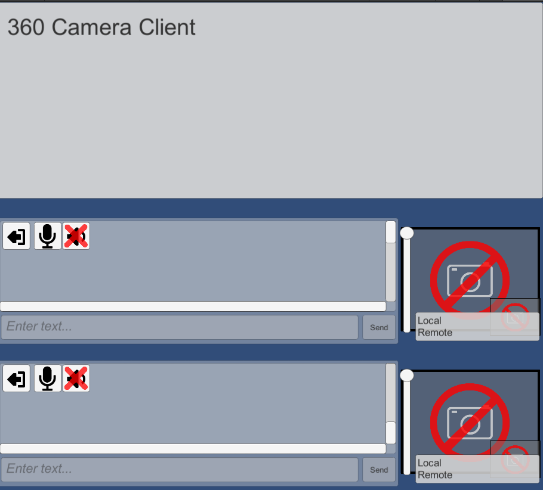
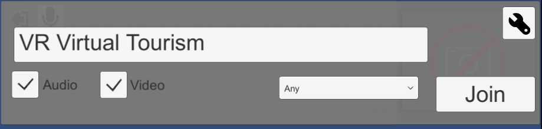
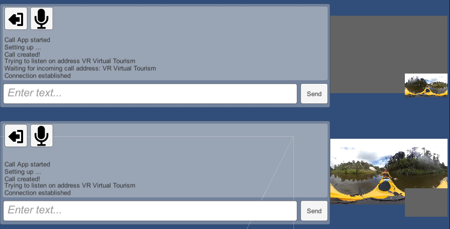

# Virtual-Tourism-Headset-Client-

### Project Purpose
To explore the applications of Virtual Reality Tourism in NZ with the use of peer-to-peer internet connetion protocals and 360 cameras. The system uses live streamed 360 video between Unity Clients using WebRTC. 

### Client Description (Headset)
The Camera Client is much the same as the Headset Client except the client is connected to a 360 camera and is running standalone on a android phone or windows machine. The client sends both video+audio and recieves audio. The types of data sent across the channel can be toggled shown in the UI below with a built in chat channel.  

The client is recieving/sending a stream through a WebRTC connection. WebRTC is enabled in Unity with the help of Unity WebRTC Native libraries https://github.com/Unity-Technologies/com.unity.webrtc. I also use https://because-why-not.com/webrtc/ plugin which is built upon the Native libraries and handles alot of the UI and server configurations. I had built a Unity WebRTC solution from scratch but found end to end systems across devices and over mobile networks. because-why-not plugin proved much more robust. 

Above shows the name of the room peers are connecting to "VR Virtual Tourism" The Demo below is streaming to itself using both its call panels however can just use one to contact another client. There is two connection panels to enable connection within one Unity environment for bug testing however more often will want to only use one connection panel shown below. In the connection panel we can see a preview render of the camera client peer stream. We can also access resolution and FPS information of the stream by clicking on the preview panel. This differs from the FPS on the top left hand side which indicates the FPS the app is running independent of the stream latency.   

### Networking 

There are 3 servers involved in WebRTC connection,

1. **STUN server**: These are lightweight servers which allow clients to find out their public address after NAT. These are provided for free by google shown above in **U Ice Server 2**
2. **TURN server**: (optional). These servers are heavyweight servers relaying the traffic between peers when direct peer-to-peer connection cannot be achieved. these servers ensure connection in all scenarios by acting as a backup. Often I didn't have a TURN server setup as most of the time direct connection was succesful. Direct connection failed in testing (At UoO) when I attempted to go across from Student<->Staff network domains however worked well in other situations including 3G/4G. Above shows the custom COTURN server setup https://github.com/coturn/coturn which doubles as a TURN and STUN server. This was hosted on AWS EC2 (now shutdown). Address shown under **U Ice Server 1**
3. **Signalling Server (SS)**: This server is responsible for passing the offer/answer/candidate Session Description Protocol (SDP)'s. I had created my own SS with a modified version of https://github.com/bengreenier/node-dss to be compatiable with because-why-not plugin hosted on AWS EC2 but am currently using the because-why-not plugin provided server shown in **U Signalling Url**

