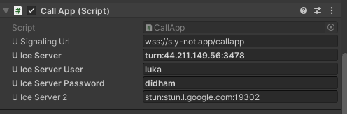

# Virtual-Tourism-Headset-Client-

### Project Purpose
To explore the applications of Virtual Reality Tourism in NZ with the use of peer-to-peer internet connetion protocals and 360 cameras. The system uses live streamed 360 video between Unity Clients using WebRTC. 

### Client Description (Headset)
The Headset Client is much the same as the Camera Client except instead of being connected to a 360 camera it is running standalone on a headset (Quest 1/2) and is only sending audio but still recieving video+audio. The types of data sent across the channel can be toggled shown in the UI below with a built in chat channel.  

The client is recieving/sending a stream through a WebRTC connection. The video stream is then rendered onto the sphere giving the 360 affect shown below. WebRTC is enabled in Unity with the help of Unity WebRTC Native libraries https://github.com/Unity-Technologies/com.unity.webrtc. I also use https://because-why-not.com/webrtc/ plugin which is built upon the Native libraries and handles alot of the UI and server configurations. I had built a Unity WebRTC solution from scratch but found end to end systems across devices and over mobile networks. because-why-not plugin proved much more robust. 

The Demo video shown in the images is being sent by the camera client running seperatly on another machine. In the image below we can see two connection panels. There is two connection panels to enable connection withon one Unity environment for bug testing however more often will want to only use one connection panel shown below. In the connection panel we can see a preview render of the camera client peer stream. We can also access resolution and FPS information of the stream by clicking on the preview panel. This differs from the FPS on the top left hand side which indicates the FPS the app is running independent of the stream latency.   

### Networking 

There are 3 servers involved in WebRTC connection,

1. STUN server. These are lightweight servers which allow clients to find out their public address after NAT. These are provided for free by google shown above in **U Ice Server 2**
2. TURN server (optional). These servers are heavyweight servers relaying the traffic between peers when direct peer-to-peer connection cannot be achieved. these servers ensure connection in all scenarios by acting as a backup. Often I didn't have a TURN server setup as most of the time direct connection was succesful. Direct connection failed when 

